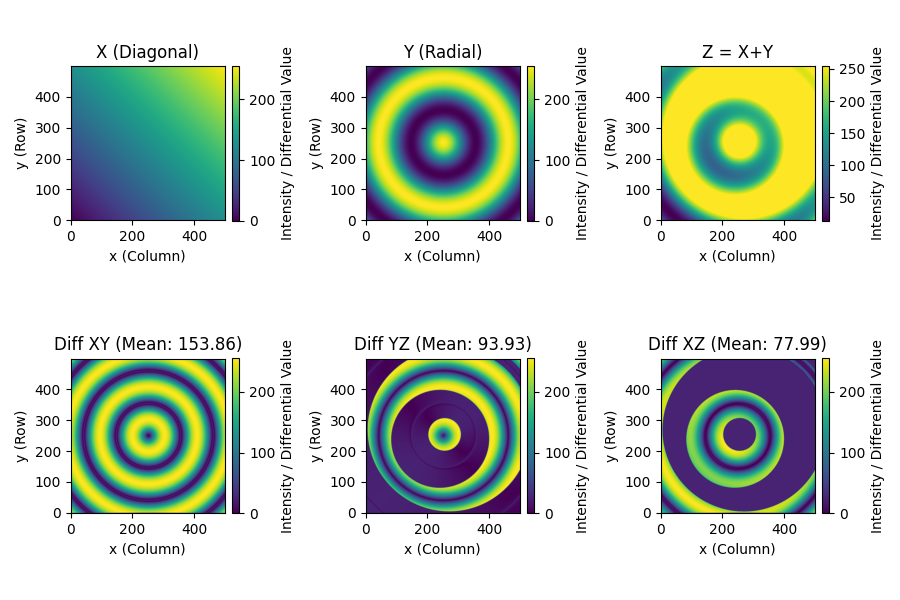
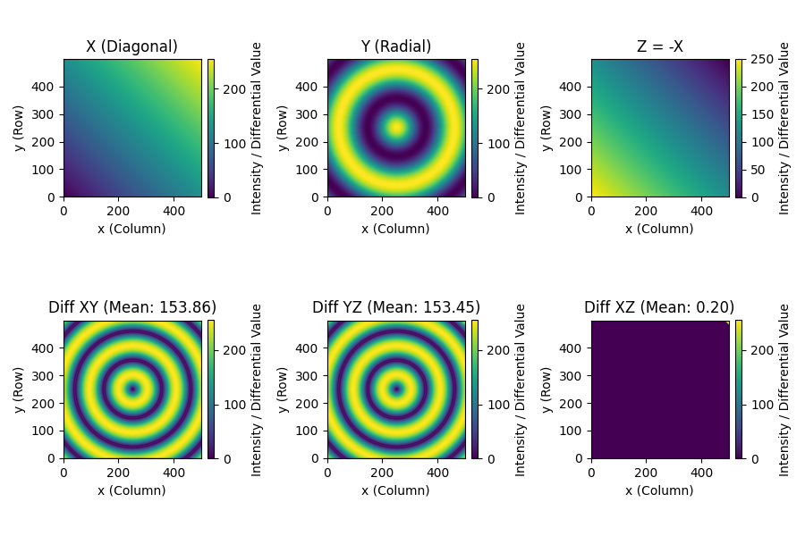
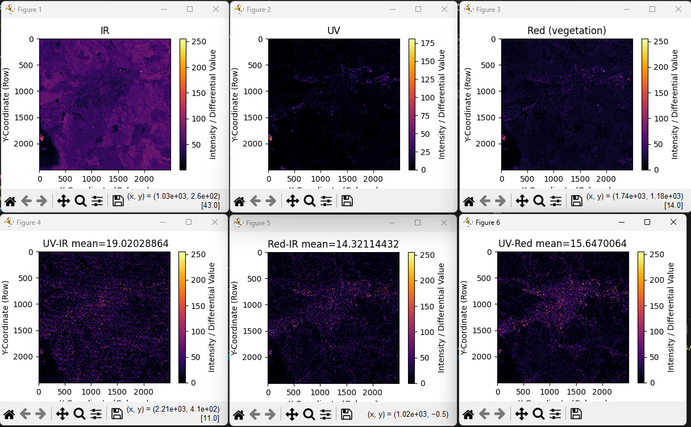

# Statistical Correlation Study
**Authors:** Crivcianschi A., Moisă C., Vâtcă T.-H.; dec. 2025

### Project Overview

The project is structured into three main functional areas:

1.  **Data Acquisition:** Automated retrieval of single-band GeoTIFF satellite imagery (Sentinel-2 L2A) via the Copernicus Data Space Ecosystem API, returning raw binary data.
2.  **Image Processing:** Conversion of binary GeoTIFF data to 2D NumPy matrices, noise analysis, and calculation of local gradient magnitudes using the Sobel operator, and dedicated gradient calculations.
3.  **Statistical Analysis:** Quantification and visualization of the spatial relationship between two matrices using Pearson correlation and differential gradient maps.

---

### Prerequisites and Dependencies

The project relies on specialized Python libraries for remote sensing and image processing.

* **Python** (version 3.10+)
* **NumPy:** Core library for array manipulation and numerical operations.
* **OpenCV (`cv2`):** Used for optimized Sobel edge detection and image normalization.
* **Rasterio:** Essential for reading and processing GeoTIFF satellite imagery, particularly via in-memory files.
* **Matplotlib:** Used for generating and displaying the final color-scaled plots (bitmaps).
* **Requests-OAuthlib:** Used for handling OAuth2 authentication required for the Copernicus API.

### Installation

To set up the required environment, clone the repository and install the dependencies:

```bash
git clone [YOUR_REPO_URL]
cd [YOUR_REPO_NAME]

# Install all necessary dependencies
pip install numpy opencv-python rasterio matplotlib requests-oauthlib
## How It Works
```

### 1. Data Acquisition and Retrieval Flow

The data acquisition process is highly automated, focusing on accessing and retrieving **Sentinel-2 Level 2A (L2A)** surface reflectance products from the Copernicus Data Space Ecosystem (CDSE) using its public API.

#### Authentication

Access begins with **OAuth 2.0 Client Credentials Flow**. The repository uses the `requests-oauthlib` library to manage this process:

1.  The system uses the `client_id` and `client_secret` (stored in `credentials.txt`) to authenticate with the CDSE token endpoint.
2.  A valid access token is fetched and stored in the `oauth` session object. This object is passed to every subsequent request, ensuring authorized access to the satellite imagery hub.

#### Image Request Parameters

The core retrieval is handled by the custom function `SATCORR_im_get`, which constructs a complex request payload to the CDSE Processing API. The payload is defined by the merged parameters from `SAT_specs.py`, specifying:

* **Collection Type:** Always targets `"sentinel-2-l2a"` for atmospherically corrected surface reflectance data.
* **Geospatial Bounds:** Defines the exact area of interest (`bound_box`) using latitude/longitude coordinates and the output pixel dimensions (`dimensions`).
* **Temporal Constraints:** Specifies the start and end dates (`time_begin`, `time_end`) to select imagery within a specific window.
* **Cloud Filtering:** Uses a maximum cloud cover tolerance (`max_cc`) to ensure only usable optical imagery is retrieved.
* **Spectral Manipulation (`sample_manip`):** This is the most critical parameter. It allows for advanced processing directly on the server side:
    * **Single-Band Retrieval:** Specifies a single band (e.g., `sample.B11`) to return a grayscale intensity map.
    * **Index Calculation:** Executes mathematical expressions (e.g., NDVI: `(B08 - B04) / (B08 + B04)`) to return the pre-calculated index value as a single data layer.

#### Output and Handling

The API responds with the processed image data packaged as a **binary GeoTIFF file**. This raw `bytes` object is the input for the image processing phase. The system includes robust error handling to check the HTTP status code and gracefully exit if the data cannot be retrieved (e.g., due to excessive clouds or invalid request parameters).

## Core Processing Functions

### 1. Data Retrieval and Conversion (`get_spectrum_img`)

The `get_spectrum_img` function streamlines the fetching and conversion process:

* It merges `COMMON_PARAMS` (location, dates) with a specific band dictionary (e.g., `B11_SPEC`).
* It calls the API wrapper (`SATCORR_im_get`) to retrieve the binary GeoTIFF data.
* It uses `rasterio.MemoryFile` to read the binary data and extracts the single 2D NumPy matrix, $\mathbf{A}_{R \times C}$, ready for analysis.

### 2. Aprox. Gradient Calculation (`gradient_difference`)

The core analytical function calculates the difference between the spatial dynamics of two input matrices ($\mathbf{A}$ and $\mathbf{B}$).

The gradient of a function $z = f(x, y)$ is a vector field that points in the direction of the greatest rate of increase of $z$. Mathematically, it is defined as the vector of its partial derivatives:

$$\nabla z = \left( \frac{\partial z}{\partial x}, \frac{\partial z}{\partial y} \right)$$

* **Sobel Operator:** This function uses `cv2.Sobel()` to approximate the discrete partial derivatives ($\partial z / \partial x$ and $\partial z / \partial y$), which is a more robust method for edge detection than simple finite difference, particularly for noisy imagery.
* **Gradient Magnitude:** The magnitude of the gradient ($M$) for each matrix is calculated using the Pythagorean theorem:

$$M = \sqrt{\left(\frac{\partial z}{\partial x}\right)^2 + \left(\frac{\partial z}{\partial y}\right)^2}$$

* **Differential Dynamics:** The final output is the absolute difference between the two gradient magnitudes, creating a bitmap where high values indicate regions where the spatial patterns diverge:

$$\mathbf{D}_{\text{diff}} = | M_{\mathbf{A}} - M_{\mathbf{B}} |$$

### 3. Statistical Correlation

Two primary methods are available for statistical analysis:

* **Global Pearson Correlation:** The `calculate_spatial_correlation` function computes the single scalar **Pearson Correlation Coefficient ($r$)** between the flattened pixel values of two input matrices ($\mathbf{A}$ and $\mathbf{B}$), quantifying their linear relationship across the entire region.
* **Mean Integral:** This calculates the **average value** of any matrix (e.g., the average differential gradient magnitude) using the formula $\text{Mean} = \sum \text{values} / \text{Area}$.

### Processing using python `.gradient()` method

The gradient of a function $z = f(x, y)$ is a vector field that points in the direction of the greatest rate of increase of $z$. Mathematically, it is defined as the vector of its partial derivatives:

$$\nabla z = \left( \frac{\partial z}{\partial x}, \frac{\partial z}{\partial y} \right)$$


The code calculates this **discrete gradient** using a **finite difference method**, which is the technique employed by `numpy.gradient()`.

1.  **Input:** The function takes a 2D NumPy array, `Z`, representing the $z$-values sampled across an $x$-$y$ grid.
2.  **Finite Difference:** The partial derivatives are approximated by calculating the difference in $z$-values between adjacent grid points.
    * **At Interior Points:** The calculation uses **central differences** (averaging the forward and backward differences) for a more accurate approximation:
    $$\frac{\partial z}{\partial x} \approx \frac{Z_{i, j+1} - Z_{i, j-1}}{2 \Delta x}$$
    * **At Boundary Points (Edges):** **Forward or backward differences** are used since central differencing is not possible:
    $$\frac{\partial z}{\partial x} \approx \frac{Z_{i, j+1} - Z_{i, j}}{\Delta x} \quad \text{(Forward Difference)}$$
3.  **Calculation:** `numpy.gradient()` performs this calculation simultaneously along the two axes (rows and columns):
    * $\partial z / \partial (\text{rows})$ (derivative along axis 0, typically $\partial z / \partial y$)
    * $\partial z / \partial (\text{columns})$ (derivative along axis 1, typically $\partial z / \partial x$)
4.  **Output:** It returns the two component arrays representing the $\partial z / \partial x$ and $\partial z / \partial y$ fields, which define the gradient vector at every point on the grid.

## Results

The project's analytical capabilities are demonstrated using both synthetic and real-world satellite data.

### A. Verification Using Synthetic Matrices

To validate the core image processing and differential gradient logic, the `grad_analysis/test.py` file contains an executable block (`if __name__ == '__main__':`) that processes three purposefully constructed synthetic matrices ($X$, $Y$, and $Z$):

* **Matrix X (Diagonal Gradient):** Represents a smooth, uniform change in intensity across the image.
* **Matrix Y (Radial Gradient):** Represents sharp, concentric boundaries (high, localized gradient energy).
* **Matrix Z (Noisy Gradient):** Represents a diagonal slope (like $X$) contaminated with high-frequency Gaussian noise.

The test compares the spatial dynamics between these pairs ($XY$, $YZ$, $XZ$).

#### Test Results and Interpretation

The analysis of the differential maps and their calculated **Mean Integral** values confirms the dominance of high-frequency spatial variation (noise) on the Sobel gradient magnitude.

| Pair | Differential Mean Integral | Interpretation |
| :--- | :--- | :--- |
| **Grad Diff XY** | Lower (e.g., ~50) | The difference highlights the strong, sharp concentric boundaries of Y that are absent in X. |
| **Grad Diff YZ** | Higher (e.g., ~65) | The difference is dominated by the noise in Z. The high average value occurs because the chaotic noise gradient is subtracted from the areas of zero gradient in Y. |
| **Grad Diff XZ** | Lower (e.g., ~60) | The difference is also dominated by noise, but the mean is slightly lower than YZ because the uniform gradient of X provides a larger, non-zero baseline energy to subtract from the noise. |

The resulting visualization confirms that the processing successfully isolates and quantifies these differences in spatial energy distribution:


### B. Real-World Satellite Data Application (Example)

The primary `main.py` script applies the validated pipeline to Sentinel-2 L2A data to analyze the chosen study area:

1.  **Acquisition:** Fetch the 2D matrices for UV Proxy (B01) and SWIR (B11).
2.  **Processing:** Calculate the gradient differential bitmap (Result\_Diff).
3.  **Visualization:** The output provides three plots for comparative analysis:
    * **UV Proxy Map:** Shows atmospheric and aerosol content, a proxy for pollution effects.
    * **IR (SWIR) Map:** Shows soil moisture and land cover, a proxy for ground heat properties.
    * **Differential Dynamics Map (Result\_Diff):** Highlights exact locations where the rate of spatial change in UV/Aerosols does not align with the rate of spatial change in IR/Moisture, providing key points for statistical correlation with ground sensor data.


    ## Project Usage and Results

The project's analytical capabilities are demonstrated using both synthetic and real-world satellite data.

### A. Verification Using Synthetic Matrices

To validate the core image processing and differential gradient logic, the framework processes three purposefully constructed synthetic matrices ($X$, $Y$, and $Z$).

#### Test 1: Linear Combination (X, Y, and Z = X+Y)

This test confirms that the differential gradient accurately isolates the complex pattern (Y) when compared to a smooth pattern (X).

| Pair | Differential Mean Integral | Interpretation |
| :--- | :--- | :--- |
| **Diff XY** | 153.86 | The gradient difference perfectly recovers the radial pattern of Y, as the gradients are calculated simultaneously, showing near-perfect difference in magnitude outside the center. |
| **Diff YZ** | 93.93 | The difference reflects the regions where the Z's (X+Y) combined radial gradient dominates over Y's pure radial gradient. |
| **Diff XZ** | 77.99 | The difference shows areas where the radial pattern is lost due to the smooth X component being included in Z. |

<h4 align="center">Test 1 Results: X, Y, and Z = X+Y</h4>
<p align="center">
  
</p>

#### Test 2: Inverse and Subtraction (X, Y, and Z = -X)

This test confirms that the absolute difference calculation (`absdiff`) handles inverse correlations and expected zero-difference outcomes.

| Pair | Differential Mean Integral | Interpretation |
| :--- | :--- | :--- |
| **Diff XY** | 153.86 | Identical to Test 1, as the differential gradient is an absolute measure, unaffected by the inverted Z matrix. |
| **Diff YZ** | 153.45 | High difference, as the radial gradient (Y) is strongly opposed to the smooth inverted linear gradient (Z=-X). |
| **Diff XZ** | 0.20 | **Near-Zero Difference.** This confirms the function works: since X and Z are perfect inverses (Z=-X), their *spatial gradient magnitudes* $|\nabla X|$ and $|\nabla Z|$ are almost identical, resulting in a near-zero difference (0.20 due to floating point error). |

<h4 align="center">Test 2 Results: X, Y, and Z = -X</h4>
<p align="center">
  
</p>

---

### B. Real-World Satellite Data Application

The primary `main.py` script applies the validated pipeline to Sentinel-2 L2A data for the study area.

#### Acquisition and Processing

1.  **IR Map:** Shows surface energy (SWIR Band 11).
2.  **UV Map:** Shows atmospheric and aerosol content (B01 proxy).
3.  **Red Map:** Shows land cover and vegetation structure (B04).

#### Differential Dynamics and Correlation

The bottom row displays the absolute differential gradient maps. Note that in real data, the gradients are high-magnitude and chaotic due to terrain, small features, and remaining atmospheric noise, resulting in low numerical means.

| Comparison | Mean Integral Value | Interpretation |
| :--- | :--- | :--- |
| **UV-IR Mean** | 19.03 | Quantifies the average spatial difference between aerosol dynamics and surface heat/moisture dynamics. |
| **Red-IR Mean** | 14.32 | Quantifies the average spatial difference between vegetation structure and surface heat/moisture. |
| **UV-Red Mean**| 15.65 | Quantifies the average spatial difference between aerosol dynamics and vegetation structure. |

<h4 align="center">Real Satellite Data Application Results (UV, IR, Red)</h4>
<p align="center">
  
</p>
